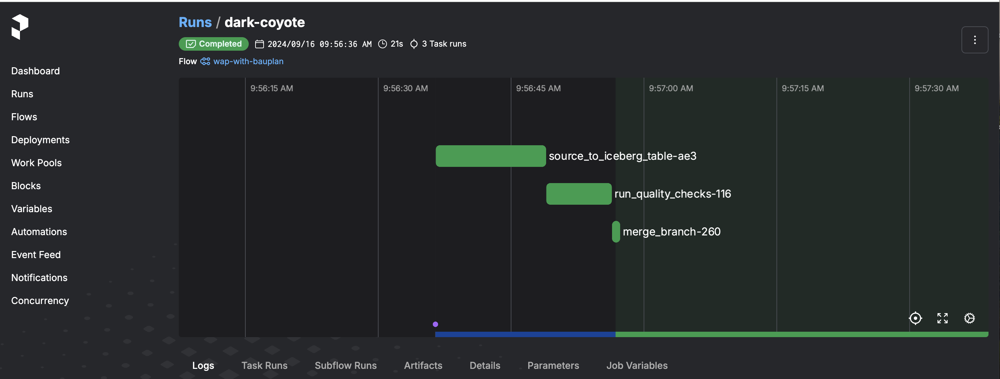

# Write-Audit-Publish with Bauplan and Prefect
A reference implementation of the write-audit-publish pattern with Bauplan and Prefect 3.0

## Overview

A common need on S3-backed analytics systems (e.g. a data lakehouse) is safely ingesting new data into tables available to downstream consumers. Due to their distributed nature and large quantity of data to be bulk-inserted, a lakehouse ingestion is more delicate than the equivalent operation on a traditional database.

Data engineering best practices suggest the Write-Audit-Publish (WAP) pattern, which consists of three main logical steps:

* Write: ingest data into a ''staging'' / ''temporary'' section of the lakehouse - the data is not visible yet to downstream consumers;
* Audit: run quality checks on the data, to verify integrity and quality (avoid the ''garbage in, garbage out'' problem);
* Publish: if the quality checks succeed, proceed to publish the data to the main section of the lakehouse - the data is now visible to downstream consumers; otherwise, raise an error / clean-up etc.

This repository showcases how [Prefect](https://www.prefect.io/) and [Bauplan](https://www.bauplanlabs.com/) can be used to implement WAP in ~150 lines of no-nonsense pure Python code: no knowledge of the JVM, SQL or Iceberg is required.  

In particular, we will leverage [Prefect transactions](https://docs-3.prefect.io/3.0rc/develop/transactions#write-your-first-transaction) as the ''outer layer'' for safe handling of the relevant _tasks_, and [Bauplan transactions (through branches)](https://docs.bauplanlabs.com/en/latest/tutorial/02_catalog.html) as the ''inner layer'' for safe handling of the relevant _data assets_. 

* For a longer discussion on the context behind the project and the trade-offs involved, please refer to our [blog post](https://www.prefect.io/blog/prefect-on-the-lakehouse-write-audit-publish-pattern-with-transactions-and-git-for-data).
* To get a quick feeling on the developer experience, check out this [demo video](https://www.loom.com/share/0387703f204e4b3680b1cb14302a04da?sid=536f3a9f-c590-4548-a3c2-b5861b8c17c0).

## Setup

### Bauplan

Bauplan is the programmable lakehouse: you can load, transform, query data all from your code (CLI or Python). You can learn more [here](https://www.bauplanlabs.com/), read the [docs](https://docs.bauplanlabs.com/) or explore its [architecture](https://arxiv.org/pdf/2308.05368) and [ergonomics](https://arxiv.org/pdf/2404.13682).

To use Bauplan, you need an API key for our preview environment: you can request one [here](https://www.bauplanlabs.com/#join).

Note: the current SDK version is `0.0.3a182` but it is subject to change as the platform continues to evolve - ping us if you need help with any of the APIs used in this project.

### Prefect and the Python environment

Install the required dependencies (Bauplan and Prefect) in a virtual environment:

```bash
python3 -m venv venv
source venv/bin/activate
pip install -r requirements.txt
```

## Run the flow

Run the WAP flow:

```bash
cd src
python bauplan_flow.py
```

This is a [video demonstration](https://www.loom.com/share/0387703f204e4b3680b1cb14302a04da?sid=536f3a9f-c590-4548-a3c2-b5861b8c17c0) of the flow in action, both in case of successful audit and in case of failure.

If you also started a Prefect server, you can visualize the flow in the UI, i.e.

```bash
prefect server start
```

Then open the Prefect URL and check out the latest run:




## License

The code in the project is licensed under the MIT License (Prefect and Bauplan are owned by their respective owners and have their own licenses). 
